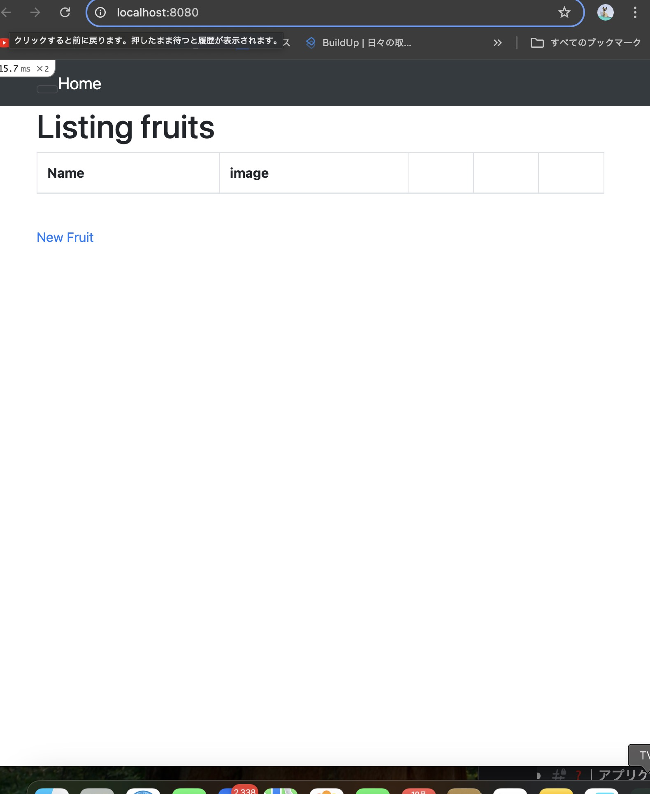
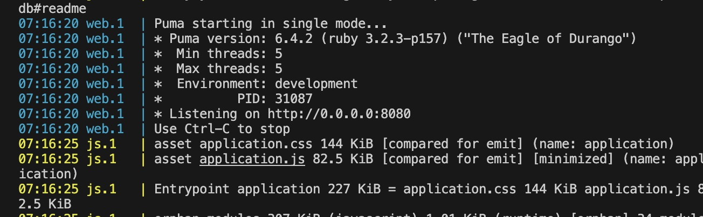
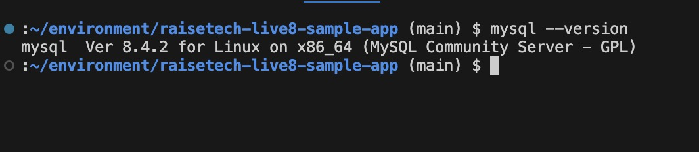
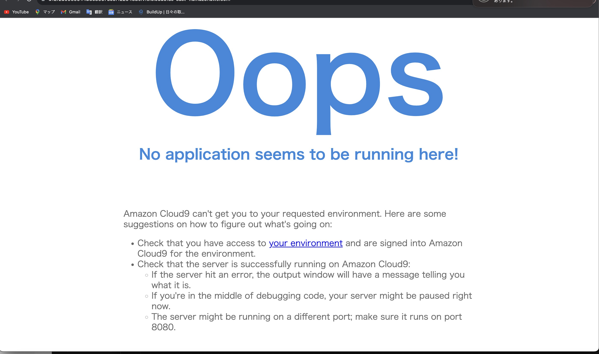
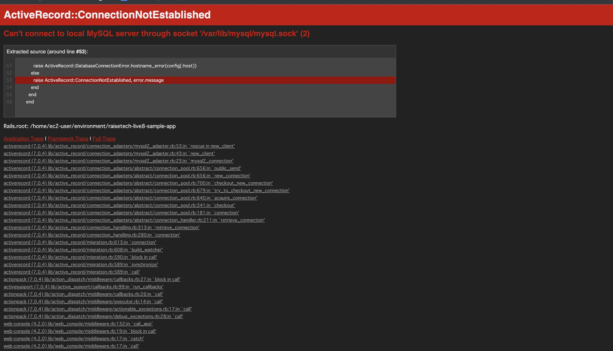

# 第３回課題
1.サンプルアプリケーションデプロイ

2. APサーバーの名前とバージョンとDBサーバーの名前とバージョン
- Puma 6.4.2　　MySQL 8.4.2

3. APサーバー終了させた場合とDBサーバー終了させた場合アクセス出来るか？
 下記の画像のようにアクセスできない
- APサーバーの場合

- DBサーバーの場合

4.Railsの構成管理ツールの名前
- Bundler
# 第3回課題で学んだ事
- culoud9でやった時よりだいぶ苦労しましたが、バージョンを合わせてパスを通すことでいけたのでその重要性がわかってよかった。まだ何となくでしか掴めていないがちゃんと理解出来るよう頑張る。