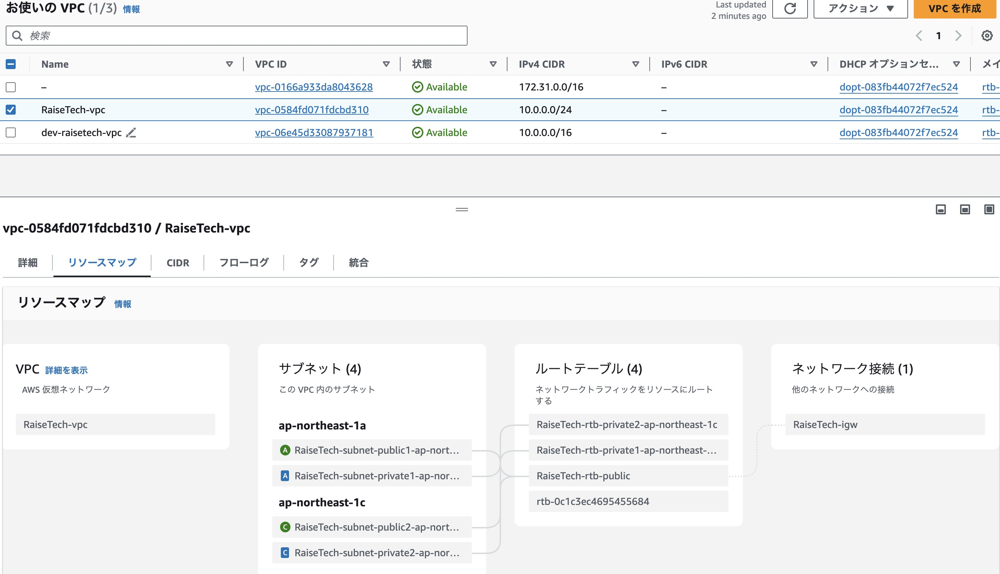
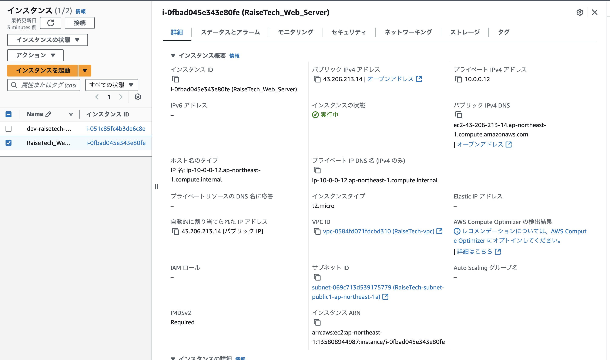
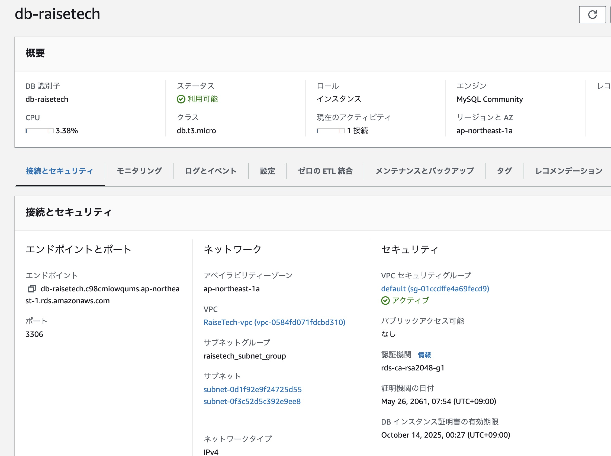
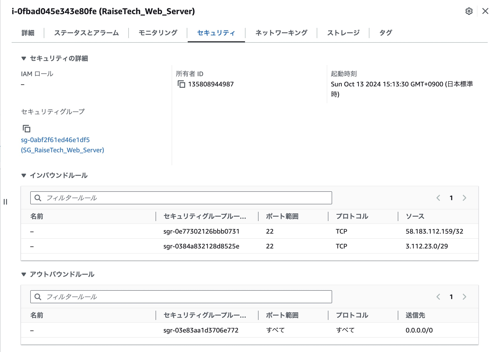
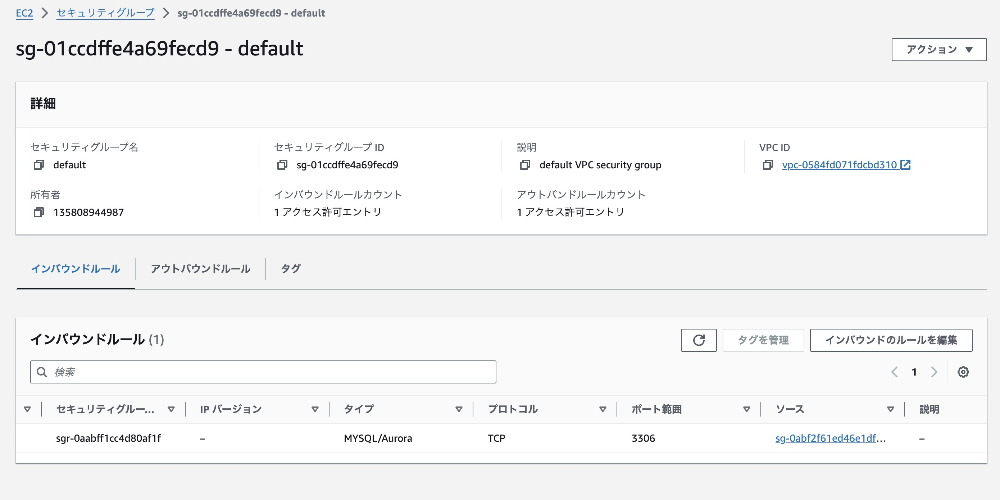
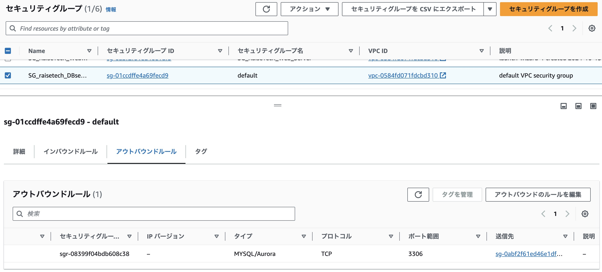
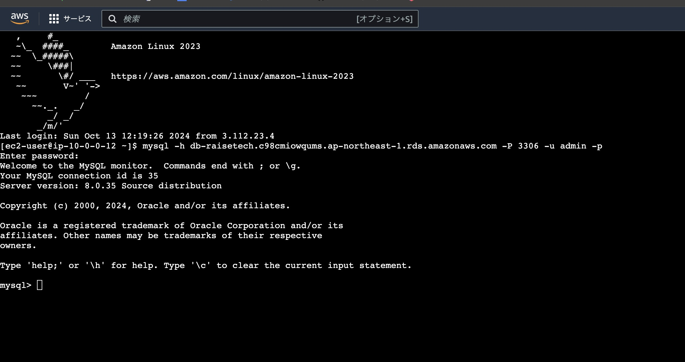

# 第４回課題
1. vpc作成

2. EC2インスタンス作成

3. RDS作成

4. EC2のセキュリティグループ

5. RDSのセキュリティグループ

6. EC2からRDSに接続

## 第4回課題感想
セキュリティグループのインバウンドルールとアウトバウンドルールをよく理解しないといけないと思った、接続できなかったら設定が違うので確認して修正が出来ていたら接続できる。