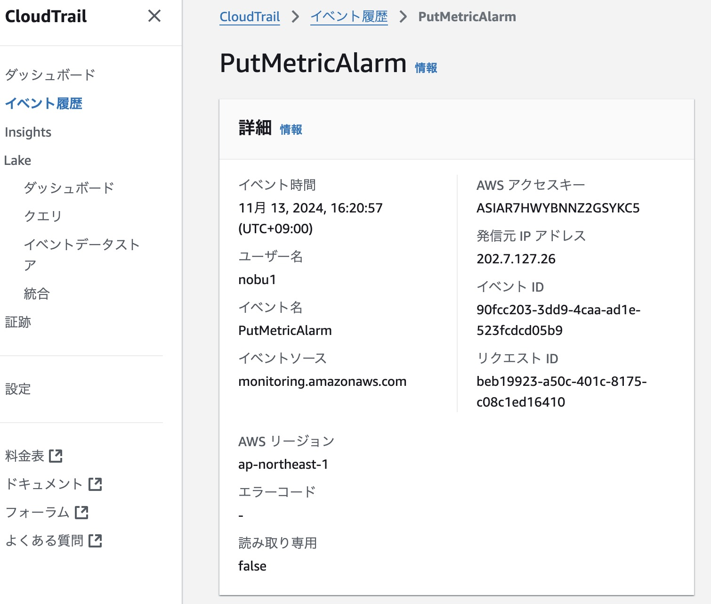
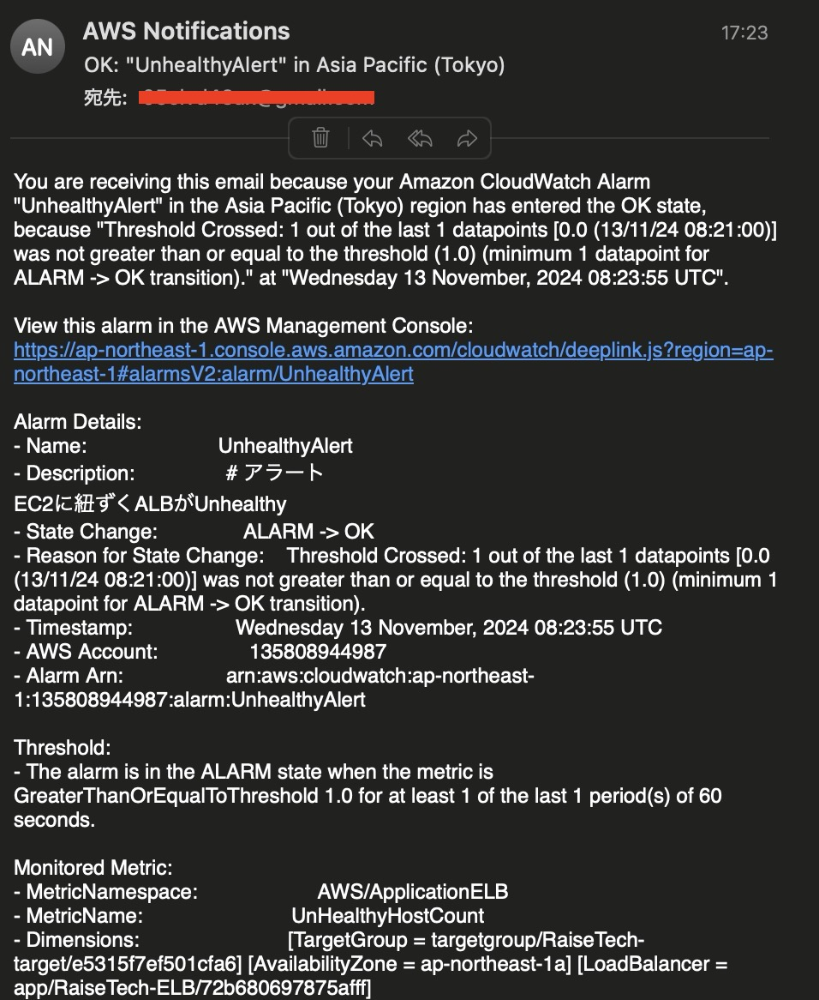
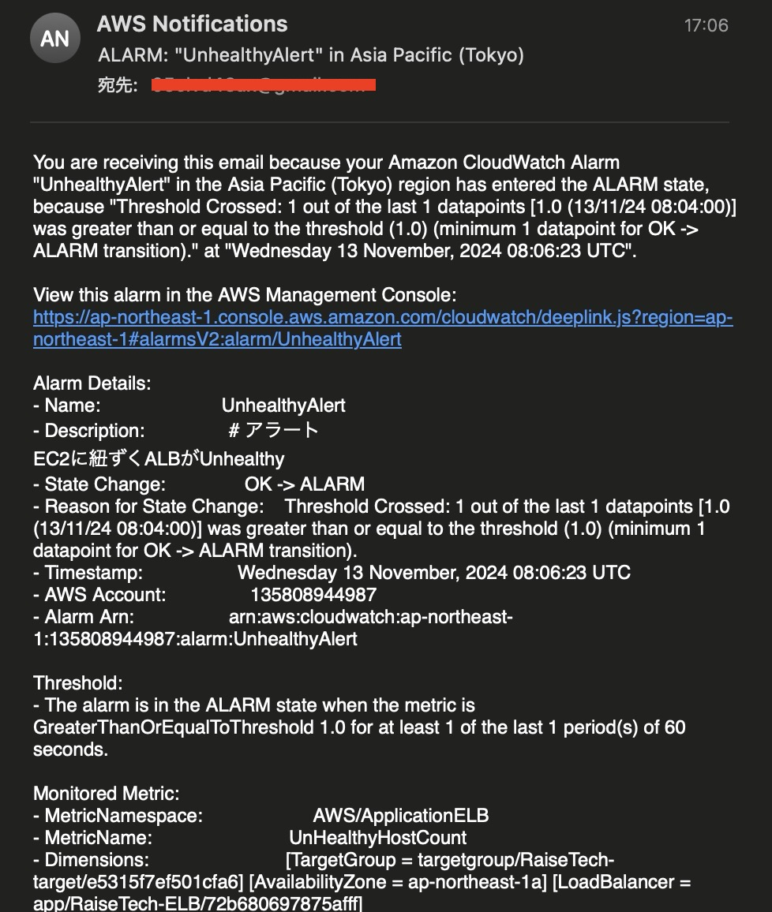
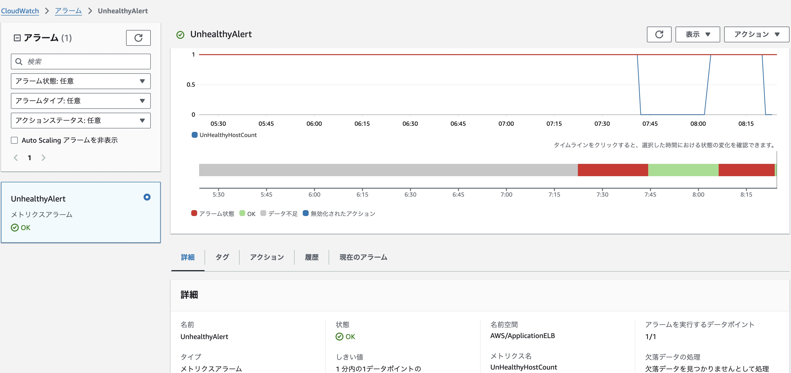
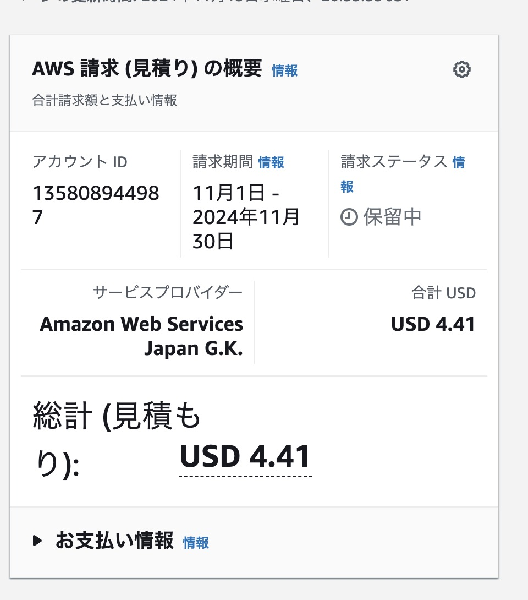
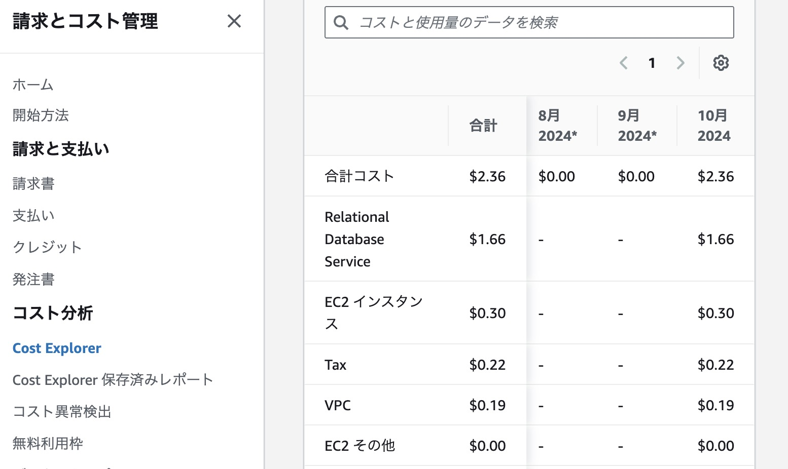

# 第6回課題
**CloudTrailイベント情報**

イベント名
* PutMetricAlarm

**含まれている内容**

* イベント時間
* ユーザー名
* イベントソース

**CloudWatchアラーム**

サンプルアプリ起動時の通知メール　(OK)　　

サンプルアプリ停止時の通知メール　(ALARM)

UnHealthyHostCount詳細

**AWS利用料金見積もり**

* 今までに作成したリソースの見積もり

https://calculator.aws/#/estimate?id=36d745b1279ed318e753b123044752f3feff094e

* 現在の利用料

* 先月のEC2の利用料金

* 無料枠に収まっているか

アカウント作成から12ヶ月経過しているため対象外

**感想**

CloudTrail CloudWatchどちらも奥が深そうのなので深掘りできたらと思います。
こまめに使っていないリソースは停止するようにします。